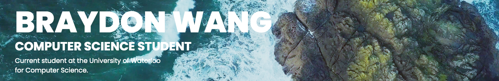

# 👋 Hi, I’m Braydon Wang!

Hello! I'm Braydon Wang, a current student at the University of Waterloo studying Computer Science. Before university, I attended Richmond Hill High School in Ontario, Canada.

I am an avid computer science learner as I am fascinated by all the things computers can do. I find myself trying to learn new algorithms and techniques that I can implement in my projects. I also enjoy doing side projects from time to time to apply what I have learned into something useful. Python was the language I started programming with, but soon after, I've been using Java a lot more. Most of my school projects and competitive programming solutions are written in Java. Recently, I've been trying to learn new languages including C++, C and Racket. I've also been trying out web development using HTML and CSS by purely learning off of Youtube videos and trial and error. Machine learning and AI has sparked my interest lately and I've been attending bootcamps and webinars to learn more about this topic.

## Competitive Programming

  
 My interest for computer science began when I was introduced to competitive programming. I really enjoyed the logical thinking and problem solving aspect of it, and how there are multiple solutions to a single problem. I practise by solving problems on various platforms like DMOJ and Codeforces, and I've participated in a number of contests including CCC, USACO and ECOO. 

  
   
  

    
    
  

## Web Development

  
 During the summer, my goal was to create my own website to teach myself the basics of HTML and CSS. I was able to do this by watching many tutorial videos and trying things out myself. In the end, I was able to create a fully functioning website where I display all of my projects, contacts and resume. 

  
   
  

    
  

## Machine Learning

  
 My curiosity for machine learning made me attend a bootcamp over the summer that went over the basics of prediction models and neural networks. Ever since that experience, I wanted to learn everything that this large and complex topic offered. Currently, I am delving into the subtopic of Natural Language Processing (NLP) and learning how computers communicate with humans through language. 

  
   
  

    
    
  

## &#x1f4c8; Github Stats

## 📝 Contact Me
* Email: [`braydon.wang@gmail.com`](mailto:braydon.wang@gmail.com)
* Instagram: https://www.instagram.com/braydon.wang/
* LinkedIn: https://www.linkedin.com/in/braydonwang/
* Discord: `Braydon#3691`
